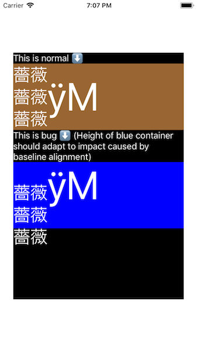

# YogaBaselineLayoutBug

This project demonstrates a bug regarding baseline alignment using `yoga`.

Below is the screenshot of the project:



Brown container attributes:

```
flexDirection: .row
```

Blue container attributes:

```
flexDirection: .row
alignItems: .baseline
```

I've modified `YogaKit` to support baseline alignment for `UILabel`s.

In the blue container, the 2 labels' frames are modified after applying baseline alignment, however the height of the container does not adapt to changes caused by baseline alignment.
